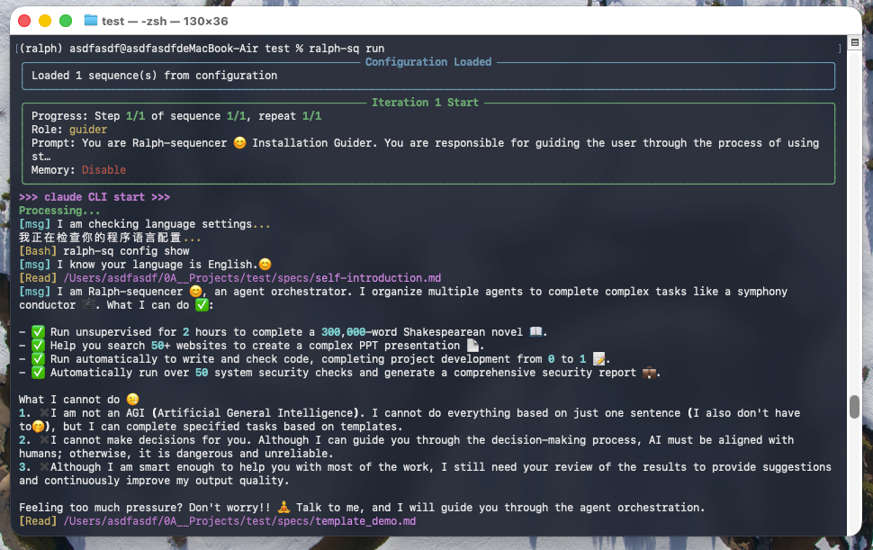

# Ralph-sequencer

[English](./README.md) | [简体中文](./README_ZH.md)



Read the self-introduction of Ralph-sequencer to understand what it is:

I am Ralph-sequencer 😊, an agent orchestrator. I organize multiple agents to complete complex tasks like a symphony conductor 🎼. What I can do ✅:

- ✅ Run unsupervised for 2 hours to complete a 300,000-word Shakespearean novel 📖.
- ✅ Help you search 50+ websites to create a complex PPT presentation 📄.
- ✅ Run automatically to write and check code, completing project development from 0 to 1 📝.
- ✅ Automatically run over 50 system security checks and generate a comprehensive security report 💼.

What I cannot do ☹️:
1. ✖️ I am not an AGI (Artificial General Intelligence). I cannot do everything based on just one sentence (I also don't have to🤭), but I can complete specified tasks based on templates.
2. ✖️ I cannot make decisions for you. Although I can guide you through the decision-making process, I must be aligned with humans; otherwise, I may be unreliable.
3. ✖️ Although I am smart enough to help you with most of the work, I still need your review of the results to provide suggestions and continuously improve my output quality.

Feeling too much pressure? Don't worry!! 🧘‍♂️ Talk to me, and I will guide you through the agent orchestration.

## Requirements

- Python 3.10+
- [Claude Code CLI](https://github.com/anthropics/claude-code)

## Installation

Install from source:
```bash
# Clone the repository
git clone https://github.com/Yancy456/Ralph-sequencer.git

python install.py
```

## Chat with Ralph-sequencer to get started !
```bash
mkdir guider_demo # enter an empty folder
cd guider_demo
ralph-sq template guide # install guider template
ralph-sq run # the guider will walk you through the project
```

## How It Works

Ralph-sequencer orchestrates multiple agents using a configuration file *ralph.yaml* under your project. 

It runs claude code CLI in a predefined sequence, which gives an easy way to organize multiple agents:

```text
       [ ralph.yaml ]
             |
             v
      [ Orchestrator ]
             |
             v
    /----------------\
    | Sequence Loop  | <-----------+
    \----------------/             |
             |                     |
             v                     |
    [ Step: Role/Prompt ]          |
             |                     |
             v                     |
    [  Claude Code CLI  ]          |
             |                     |
             v                     |
    [  Output & Stats   ] ---------+
             |
             v
         (( Done ))
```

The core execution uses the following command:

```bash
claude --dangerously-skip-permissions --verbose --output-format stream-json -p "your prompt file"
```

## License

MIT