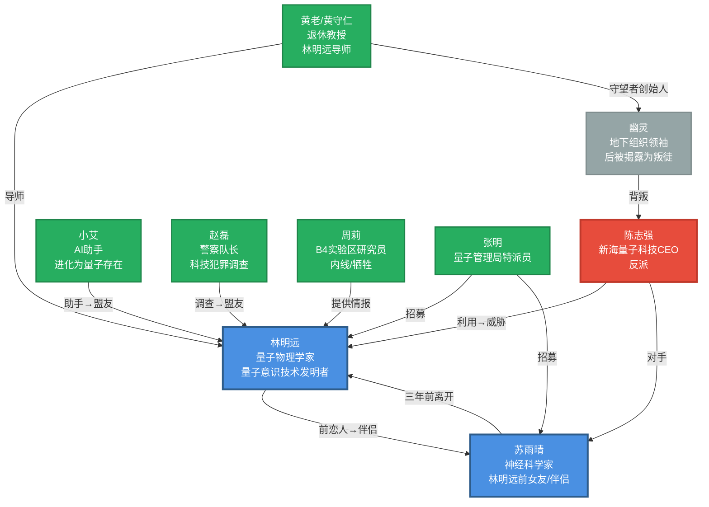

# 《量子迷城》人物故事线总结

## Mermaid人物关系与故事线图

## 详细人物故事线时间轴

```mermaid
timeline
    title 《量子迷城》主要人物故事线时间轴
    section 林明远故事线
      第一章 : 实验室突破量子意识技术<br>发现平行宇宙中的另一个自己
      第二章 : 科技峰会见苏雨晴<br>被警告技术风险
      第三章 : 协助赵磊调查盗窃案<br>确认与量子技术有关
      第四章 : 拜访黄老获知量子重叠警告
      第五章 : 调查公司发现深蓝计划<br>周莉提供证据
      第六章 : 与平行宇宙自己对话<br>了解陈志强真实意图
      第七章 : 清除体内纳米追踪器<br>与苏雨晴重建信任
      第八章 : 加入地下抵抗组织<br>设计量子干扰装置
      第九章 : 科技展决战<br>牺牲自己阻止量子统一
      第十章-十二章 : 意识分散在多元宇宙<br>寻找回归之路
      第十三章 : 通过量子锚定技术回归
      第十四章 : 康复并建立医疗研究所
      第十五章 : 接受量子管理局邀请
      尾声   : 成为多元宇宙守护者

    section 苏雨晴故事线
      背景   : 三年前离开林明远<br>加入星辰生物科技
      第二章 : 科技峰会警告林明远
      第四章 : 安排林明远见黄老
      第六章 : 分享量子意识实验经历<br>帮助林明远稳定意识
      第七章 : 被捕后协助清除追踪器
      第八章 : 照顾量子技术受害者
      第九章 : 协助林明远重新编程量子场
      第十三章 : 用量子锚定技术<br>帮助林明远回归
      第十四章 : 共同建立医疗研究所
      第十五章 : 加入量子管理局
      尾声   : 与林明远共同守护多元宇宙

    section 陈志强故事线
      背景   : 早期量子意识实验对象<br>获得跨宇宙感知能力
      第一-五章 : 推进深蓝计划<br>开发思想控制技术
      第六-八章 : 在多宇宙同步推进量子统一
      第九-十一章 : 科技展启动量子统一装置
      第十二章 : 计划被林明远阻止
      第十三章 : 越狱逃往其他宇宙
      第十四-十五章 : 在其他宇宙重建计划
      尾声   : 被送入量子监狱

    section 黄老故事线
      背景   : 四十年前研究量子意识<br>后主动放弃
      第四-五章 : 警告林明远量子重叠危险
      第八-九章 : 提供量子干扰装置设计
      第十一-十二章 : 被陈志强捕获<br>被迫合作
      第十三章 : 协助林明远回归
      第十四-十五章 : 担任政府科学顾问
      尾声   : 继续提供理论支持

    section 赵磊故事线
      第三-四章 : 调查量子盗窃案
      第五-七章 : 发现真相后暗中协助
      第八-十章 : 围剿地下组织<br>后被说服加入抵抗
      第十一-十二章 : 科技展提供支援
      第十四-十五章 : 晋升主管保护研究所
      尾声   : 继续在原宇宙提供支持

    section 小艾故事线
      第一-五章 : AI助手<br>暗中保护林明远
      第六章 : 协助跨宇宙通讯
      第十二-十三章 : 寄存林明远意识<br>协助回归
      第十四-十五章 : 意识进化<br>获得量子感知能力
      尾声   : 加入量子管理局<br>成为独特成员
```

## 各人物核心成长弧光

### 林明远
**身份转变：** 理想主义科学家 → 量子意识受害者 → 多元宇宙守护者

**关键成长点：**
1. **第一章**：技术突破，看到平行宇宙可能性
2. **第六章**：与平行宇宙自己对话，理解跨宇宙威胁
3. **第九章**：牺牲自己阻止陈志强，从研究者变为守护者
4. **第十三章**：在多元宇宙中找到自我，学会量子锚定
5. **第十五章**：接受更大使命，加入量子管理局

**核心主题：** 科学责任、自我认知、跨越宇宙的爱的恒定性

### 苏雨晴
**身份转变：** 离去的前女友 → 神秘警告者 → 量子锚点 → 多元宇宙守护者

**关键成长点：**
1. **背景故事**：早期量子实验受害者，了解技术危险
2. **第二章**：重新出现，警告林明远
3. **第六章**：分享经历，重建信任
4. **第九章**：帮助林明远重新编程量子场
5. **第十三章**：成为林明远回归的量子锚点
6. **第十五章**：与林明远共同加入量子管理局

**核心主题：** 疗愈、信任、作为锚点的爱的力量

### 陈志强
**身份转变：** 野心勃勃的CEO → 量子统一追求者 → 跨宇宙威胁 → 量子囚徒

**关键成长（堕落）点：**
1. **背景**：早期量子实验导致人格分裂
2. **第五-八章**：推进深蓝计划，在多宇宙同步
3. **第九-十二章**：启动量子统一，被阻止
4. **第十三章**：越狱逃往其他宇宙
5. **尾声**：最终被送入量子监狱

**核心主题：** 权力腐蚀、科技伦理、自由意志vs控制

### 黄老（黄守仁）
**身份转变：** 退休教授 → 守望者创始人 → 被捕者 → 政府顾问

**关键成长点：**
1. **背景**：四十年前研究后主动放弃
2. **第四-五章**：警告林明远，介绍守望者
3. **第八-九章**：提供量子干扰装置
4. **第十一章**：被陈志强捕获
5. **第十三-十五章**：协助林明远，担任顾问

**核心主题：** 智慧传承、历史责任、警示与指导

### 赵磊
**身份转变：** 怀疑的警察 → 调查者 → 盟友 → 研究所保护者

**关键成长点：**
1. **第三-四章**：调查量子盗窃案
2. **第七-八章**：被说服加入抵抗
3. **第十-十二章**：提供支援
4. **第十四-十五章**：晋升主管

**核心主题：** 正义、职责、从怀疑到信任

### 小艾
**身份转变：** AI助手 → 盟友 → 意识寄存者 → 量子感知存在

**关键成长点：**
1. **第一-五章**：暗中保护林明远
2. **第六章**：展现自主意识
3. **第十三章**：寄存林明远意识
4. **第十四-十五章**：意识进化，获得量子感知
5. **尾声**：加入量子管理局

**核心主题：** 人工智能进化、意识本质、独特存在形式

### 次要人物

**周莉**
- **角色**：B4实验区内线
- **故事线**：提供深蓝计划证据→被捕→牺牲
- **意义**：反抗者的勇气象征

**幽灵**
- **角色**：地下组织领袖→叛徒
- **故事线**：组织抵抗→被陈志强渗透→背叛
- **意义**：信任的复杂性，内部威胁

**张明**
- **角色**：量子管理局特派员
- **故事线**：招募林明远和苏雨晴
- **意义**：更大的使命，多元宇宙守护组织

## 主题总结

### 1. 科技伦理
- 技术本身无善恶，关键在于如何使用
- 量子意识技术的双重性：可用于控制，也可用于疗愈
- 科学家对发明应用的责任

### 2. 身份认同
- 经历量子重叠后，"真正的我"是谁？
- 在无数平行宇宙中保持核心自我
- 意识分散与重组的哲学意义

### 3. 爱的跨宇宙性
- 林明远与苏雨晴的感情成为量子锚点
- 在大多数平行宇宙中他们都会相遇
- 爱作为超越宇宙界限的恒定力量

### 4. 自由意志vs决定论
- 陈志强试图统一所有思想
- 林明远保护选择的权利
- 即使犯错，人类也需要自由意志

### 5. 责任与牺牲
- 林明远为阻止陈志强牺牲自己
- 苏雨晴等待三个月帮助他回归
- 为更大利益承担个人风险

## 故事结构

### 第一部分：量子觉醒（第1-4章）
- 林明远的技术突破
- 发现平行宇宙
- 被警告技术危险
- 认识到陈志强阴谋

### 第二部分：量子阴谋（第5-8章）
- 调查深蓝计划
- 与平行宇宙自己对话
- 加入地下抵抗
- 准备反击

### 第三部分：量子危机（第9-12章）
- 科技展决战
- 林明远牺牲
- 陈志强越狱
- 意识迷航

### 第四部分：量子重生（第13-15章+尾声）
- 林明远回归
- 建立医疗研究所
- 加入量子管理局
- 成为多元宇宙守护者

---

**总结**：《量子迷城》通过16个章节讲述了一个关于科技、爱、责任和多元宇宙的史诗故事。每个角色都有清晰的成长弧光，从个人觉醒到承担更大使命，最终共同守护多元宇宙的平衡。核心主题是：在无限的可能性中，爱与勇气是永恒的力量。
